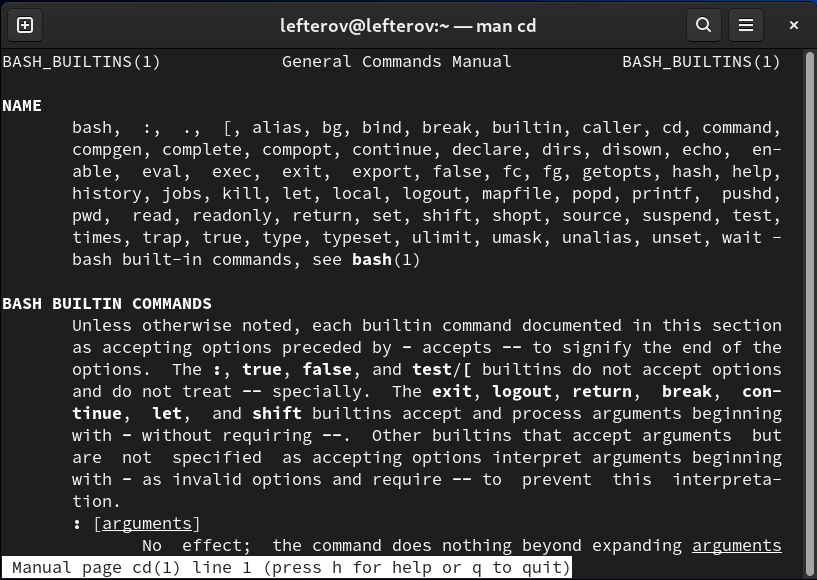

---
## Front matter
lang: ru-RU
title: Structural approach to the deep learning method
author: |
	Leonid A. Sevastianov\inst{1,3}
	\and
	Anton L. Sevastianov\inst{1}
	\and
	Edik A. Ayrjan\inst{2}
	\and
	Anna V. Korolkova\inst{1}
	\and
	Dmitry S. Kulyabov\inst{1,2}
	\and
	Imrikh Pokorny\inst{4}
institute: |
	\inst{1}RUDN University, Moscow, Russian Federation
	\and
	\inst{2}LIT JINR, Dubna, Russian Federation
	\and
	\inst{3}BLTP JINR, Dubna, Russian Federation
	\and
	\inst{4}Technical University of Košice, Košice, Slovakia
date: NEC--2019, 30 September -- 4 October, 2019 Budva, Montenegro

## Formatting
toc: false
slide_level: 2
theme: metropolis
header-includes: 
 - \metroset{progressbar=frametitle,sectionpage=progressbar,numbering=fraction}
 - '\makeatletter'
 - '\beamer@ignorenonframefalse'
 - '\makeatother'
aspectratio: 43
section-titles: true
---

# Цель работы

Приобретение практических навыков взаимодействия пользователя с системой посредством командной строки.

# Задание

Работа в терминале.

# Выполнение лабораторной работы

Пишим путь в каталог /tmp и сразу ls

{ #fig:001 width=70% }

Определяем, есть ли в каталоге /var/spool
{ #fig:002 width=70% }

Пишем pwd чтобы определить домашний каталол.
{ #fig:003 width=70% }

Создаем в домашнем каталоге новый каталог с именем newdir
{ #fig:004 width=70% }

В каталоге newdir создаем каталог с именем morefun
{ #fig:005 width=70% }

В домашнем каталоге создаем 3 каталога  letters, memos, misk
{ #fig:006 width=70% }

Удаляем сощанных каталог командой rm, и проверяем командой ls
{ #fig:007 width=70% }

С помощью команды man  опредлеяем  набор опций команды ls
{ #fig:008 width=70% }

Используя команду man проверяем описание следующих команд: cd,pwd,mkdir,rmdir,rm.
{ #fig:009 width=70% }

Пишем команду history, и выполняем модификации и исполнение нескольких команд из буфера команд.
{ #fig:0010 width=70% }

# Выводы

В ходе выполнения данной лабораторной работы были приобретены практические навыки работы на терминале и его команд.

## {.standout}

Wer's nicht glaubt, bezahlt einen Taler
