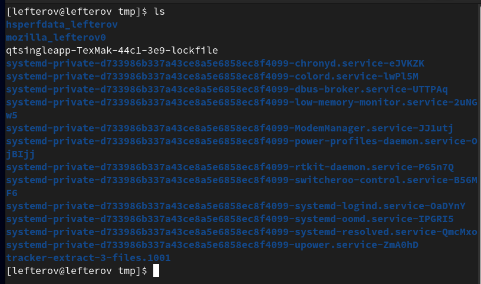
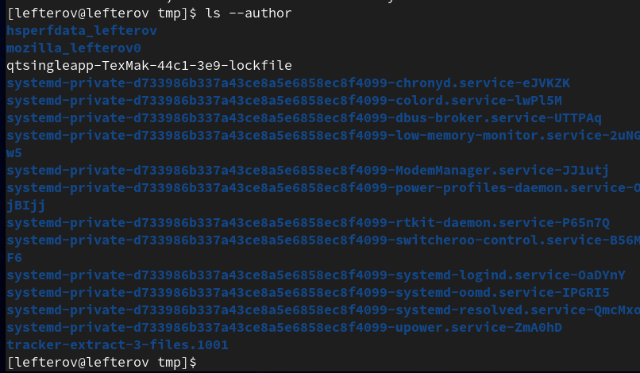
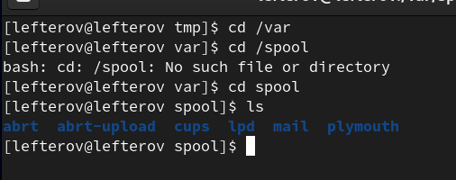
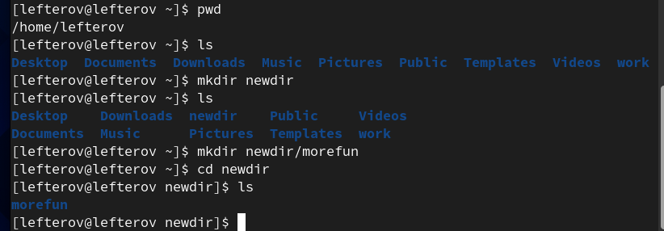
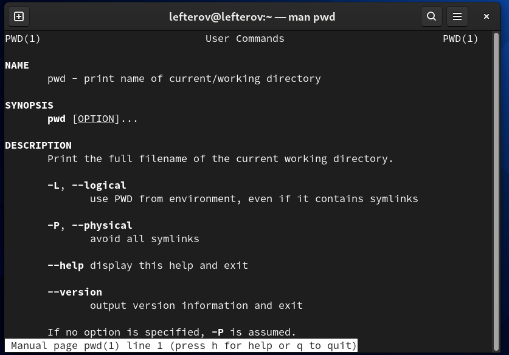
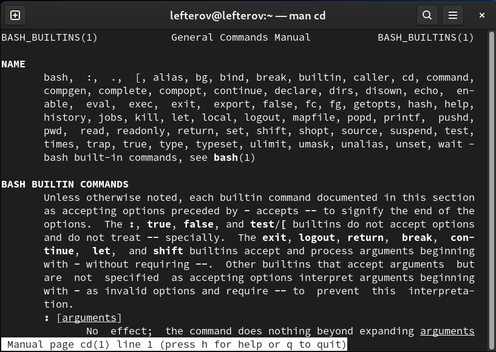
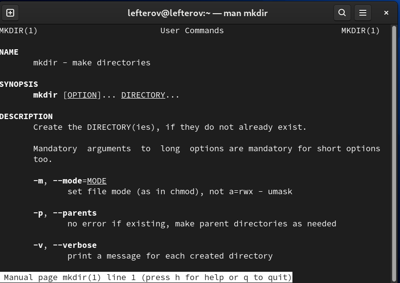
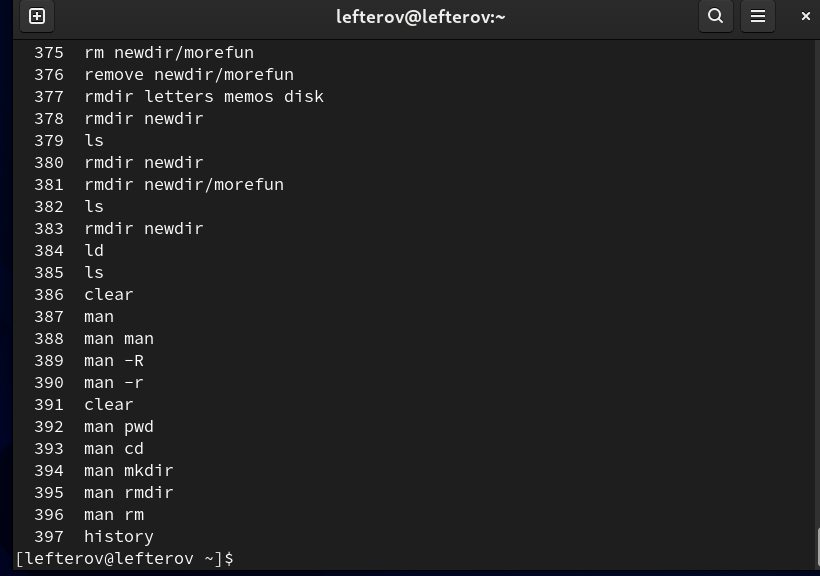
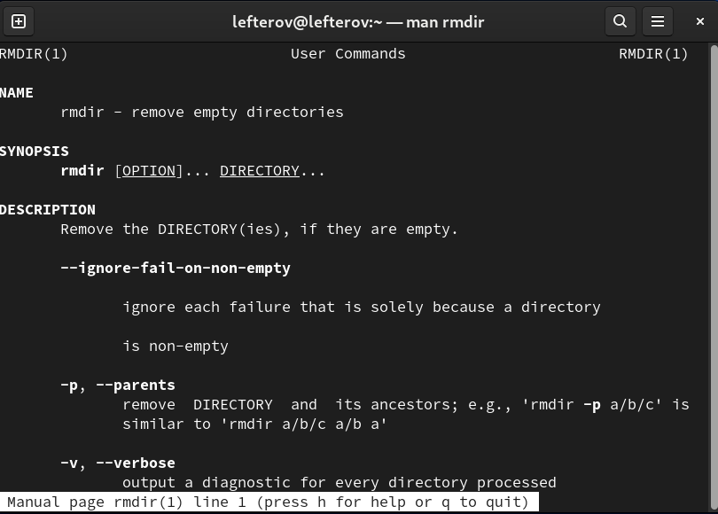
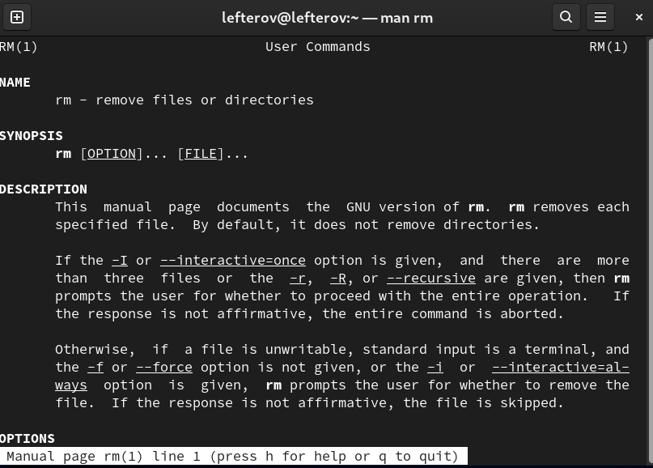

---
## Front matter
title: "Отчёт по лабораторной работе №4"
subtitle: "Предмет:ОС"
author: "Лефтеров Игорь Иванович"

## Generic otions
lang: ru-RU
toc-title: "Содержание"

## Bibliography
bibliography: bib/cite.bib
csl: pandoc/csl/gost-r-7-0-5-2008-numeric.csl

## Pdf output format
toc: true # Table of contents
toc-depth: 2
lof: true # List of figures
lot: true # List of tables
fontsize: 12pt
linestretch: 1.5
papersize: a4
documentclass: scrreprt
## I18n polyglossia
polyglossia-lang:
  name: russian
  options:
	- spelling=modern
	- babelshorthands=true
polyglossia-otherlangs:
  name: english
## I18n babel
babel-lang: russian
babel-otherlangs: english
## Fonts
mainfont: PT Serif
romanfont: PT Serif
sansfont: PT Sans
monofont: PT Mono
mainfontoptions: Ligatures=TeX
romanfontoptions: Ligatures=TeX
sansfontoptions: Ligatures=TeX,Scale=MatchLowercase
monofontoptions: Scale=MatchLowercase,Scale=0.9
## Biblatex
biblatex: true
biblio-style: "gost-numeric"
biblatexoptions:
  - parentracker=true
  - backend=biber
  - hyperref=auto
  - language=auto
  - autolang=other*
  - citestyle=gost-numeric
## Pandoc-crossref LaTeX customization
figureTitle: "Рис."
tableTitle: "Таблица"
listingTitle: "Листинг"
lofTitle: "Список иллюстраций"
lotTitle: "Список таблиц"
lolTitle: "Листинги"
## Misc options
indent: true
header-includes:
  - \usepackage{indentfirst}
  - \usepackage{float} # keep figures where there are in the text
  - \floatplacement{figure}{H} # keep figures where there are in the text
---

# Цель работы

Приобретение практических навыков взаимодействия пользователя с системой посредством командной строки.

# Задание

Работа в терминале.

# Выполнение лабораторной работы

Пишим путь в каталог /tmp и сразу ls

{ #fig:001 width=70% }

Определяем, есть ли в каталоге /var/spool
{ #fig:002 width=70% }

Пишем pwd чтобы определить домашний каталол.
{ #fig:003 width=70% }

Создаем в домашнем каталоге новый каталог с именем newdir
{ #fig:004 width=70% }

В каталоге newdir создаем каталог с именем morefun
{ #fig:005 width=70% }

В домашнем каталоге создаем 3 каталога  letters, memos, misk
{ #fig:006 width=70% }

Удаляем сощанных каталог командой rm, и проверяем командой ls
{ #fig:007 width=70% }

С помощью команды man  опредлеяем  набор опций команды ls
{ #fig:008 width=70% }

Используя команду man проверяем описание следующих команд: cd,pwd,mkdir,rmdir,rm.
{ #fig:009 width=70% }

Пишем команду history, и выполняем модификации и исполнение нескольких команд из буфера команд.
{ #fig:0010 width=70% }

# Выводы

В ходе выполнения данной лабораторной работы были приобретены практические навыки работы на терминале и его команд.

# Ответы к контрольным вопросам
1). Компьютерный терминал — устройство ввода–вывода, основные функции которого заключаются в вводе и отображении данных. У компьютерного терминала есть преимущества перед графическим интерфейсом: — снижение начальных затрат на приобретение персональных компьютеров, поскольку требования к их конфигурации минимальны, а тонкие клиенты производятся без встроенных носителей информации. — унификация – все терминалы имеют одинаковый набор программного обеспечения. — простота первоначального внедрения – нет необходимости настраивать каждый персональный компьютер в отдельности, присутствует централизованное управление информационным процессом. — экономия времени системного администратора. Все тонкие клиенты абсолютно одинаковы, вероятность поломок сведена к минимуму, а программное обеспечение установлено только на сервере. — масштабируемость. Созданный единожды образ системы для работы всей группы пользователей позволяет при минимальных затратах поддерживать легко масштабируемую сеть. Возможно быстрое создание любого количества новых рабочих мест. — безопасность и отказоустойчивость. Компьютерный терминал, загружаясь, получает операционную систему «от производителя», настройка которой осуществляется только отделом информационной поддержки. Все модификации операционной системы и прикладных программ никак не влияют ни на других пользователей, ни на образ, хранящийся на сервере. Вся пользовательская информация хранится на сервере и регулярно резервируется, что увеличивает отказоустойчивость. — защита от утечек информации – нет локальных носителей – нет возможности делать копии документов на съемные носители информации.
2). Входное имя пользователя (Login) —название учётной записи пользователя. Входному имени пользователя ставится в соответствиевнутренний идентификатор пользователя в системе (User ID,UID) — положительное целое число в диапазоне от 0 до65535, по которому в системе однозначно отслеживаются действия пользователя.
3). Учётные записи пользователей хранятся в файле/etc/passwd,который имеет следу-ющую структуру:login:password:UID:GID:GECOS:home:shell . Например,учётные записи пользователейrootиivanв файле/etc/passwdмогутбыть записаны следующим образом:root:x:0:0:root:/root:/bin/bashivan:x:1000:100::/home/ivan:/bin/bash .
4). Начиная с версии 4.6, настройки рабочей среды хранятсяв реестреx fconf.
5). В многопользовательской модели пользователи делятся напользователей с обычными правамии администраторов. Входному имени пользователя ставится в соответствие внутренний идентификатор пользователя в системе (User ID,UID) — положительное целое число в диапазоне от 0 до 65535, по которому в системе однозначно отслеживаются действия пользователя.
6). Полномочия пользователей с административными правами обычно не ограничены. В многопользовательской модели пользователи делятся напользователей с обычными правамии администраторов. Пользователь с обычными правами может производить действия с элементами операционной системы только в рамках выделенного ему пространства и ресурсов, не влияя на жизнеспособность самой операционной системыи работу других пользователей.
7). Процедура регистрации в системе обязательна для Linux. Каждый пользователь операционный системы имеет определенные ограничения на возможные с его стороны действия: чтение, изменение, запуск файлов,а так же на ресурсы: пространствона файловой системе, процессорное время для выполнение текущих задач (процессов).При этом действия одного пользователя не влияютна работу другого.Такая модель разграничения доступа к ресурсам операционной системы получила название многопользовательской.
8). Учётная запись пользователя содержит: –входное имя пользователя (Login Name); –пароль (Password); –внутренний идентификатор пользователя (User ID); –идентификатор группы (Group ID); –анкетные данные пользователя (General Information); -домашний каталог (Home Dir); –указатель на программную оболочку (Shell).
9). Входному имени пользователя ставится в соответствиевнутренний идентификатор пользователя в системе (User ID,UID) — положительное целое число в диапазоне от 0 до65535, по которому в системе однозначно отслеживаются действия пользователя. Пользователю можетбыть назначена определенная группа для доступа к некоторымресурсам, разграничения прав доступа к различным файлам и директориям. Каждаягруппа пользователей в операционной системе имеетсвой идентификатор—Group ID(GID).
10). Анкетные данные пользователя (General Information или GECOS) являются необязательным параметром учётной записи и могут содержать реальное имя пользователя (фамилию,имя),адрес,телефон.
11). Для каждого пользователя организуется домашний каталог, где хранятся его данныеи настройки рабочей среды. В домашнем каталоге пользователя хранятся данные (файлы) пользователя,настройки рабочего стола и других приложений. Содержимое домашнего каталога обычно недоступно другим пользователям с обычными правами и не влияет на работу и настройки рабочей среды других пользователей.
12). Мой домашний каталок: /afs/.dk.sci.pfu.edu.ru/home/t/b/tbkonovalova (узнаём с помощью команды pwd)
13). Администратор имеет возможность изменить содержимое домашнего каталогапользователя.
14). Учётные записи пользователей хранятся в файле/etc/passwd, который имеет следующую структуру: login:password:UID:GID:GECOS:home:shell
15). Для того, чтобы посмотреть содержимое файла /etc/shadow : изначально поле пароля содержало хеш пароля и использовалось для аутентификации.Однако из соображений безопасности все пароли были перенесены в специальный файл /etc/shadow, недоступный для чтения обычным пользователям. Поэтому в файле /etc/passwdполеpassword имеет значение x. Символ* в поле password некоторой учётной записи в файле /etc/passwd означает, что пользователь не сможет войти в систему.
16). Виртуальные консоли — реализация концепции многотерминальной работы в рамках одного устройства. Мне кажется, что в данном контексте слово “виртуальный” означает реализованный программно, симулированный, имитированный с помощью компьютера.
17). Данная программа управляет доступом к физическим и виртуальным терминалам (tty).
18). Весь процесс взаимодействия пользователя с системой с момента ре-гистрации до выхода называетсясеансом работы.
19). Toolkit (Tk,«набор инструментов»,«инструментарий») — кроссплатформенная библиотека базовых элементов графического интерфейса, распространяемая с открытыми исходными текстами.
20). Используются следующие основныетулкиты: –GTK+ (сокращение от GIMP Toolkit) — кроссплатформенная библиотека элементов интерфейса; –Qt—кросс - платформенный инструментарий разработки программного обеспеченияна языке программирования C++. GTK+ состоит из двух компонентов: –GTK—содержит набор элементов пользовательского интерфейса (таких, как кнопка, список, поле для вводатекста ит.п.) для различных задач; –GDK — отвечает за вывод информации на экран, может использовать для этого X Window System, Linux Framebuffer, WinAPI.
# Список литературы{.unnumbered}

::: {#refs}
:::
