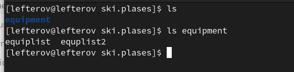

---
## Front matter
lang: ru-RU
title: Terminal
author: LEfterov Igor

## Formatting
toc: false
slide_level: 2
theme: metropolis
header-includes: 
 - \metroset{progressbar=frametitle,sectionpage=progressbar,numbering=fraction}
 - '\makeatletter'
 - '\beamer@ignorenonframefalse'
 - '\makeatother'
aspectratio: 43
section-titles: true
---

# Выполнение лабораторной работы

1.Выполняем примеры работы

{ #fig:001 width=70% }
## Продолжение работы
Продолжение работы
{ #fig:002 width=70% }
##  Создание файлов
Созданией файлов.
{ #fig:003 width=70% }
## Создаем каталог newdir
Создаем в домашнем каталоге новый каталог с именем newdir
{ #fig:004 width=70% }
## Создание файла morefun
В каталоге newdir создаем каталог с именем morefun
{ #fig:005 width=70% }
## Создание 3 каталогов
В домашнем каталоге создаем 3 каталога  letters, memos, misk
{ #fig:006 width=70% }
## Перемещение файла
Перемещаем файл
{ #fig:007 width=70% }
## Работа
С помощью команды man  опредлеяем  набор опций команды ls
{ #fig:008 width=70% }
## Конечная цель
Используя команду man проверяем описание следующих команд: cd,pwd,mkdir,rmdir,rm.
{ #fig:009 width=70% }
## Копирование файла в equpment
Копирования файла io.h в equpment
{ #fig:0010 width=70% }
## Делаем махинации
Создаем файл equepment
{ #fig:0011 width=70% }
##
Создаем два euiplist, equplist2
{ #fig:0011 width=70% }
##

# Выводы

В ходе выполнения данной лабораторной работы были приобретены навыки создания, копирования файлов и права пользовательей.

## {.standout}

Wer's nicht glaubt, bezahlt einen Taler
