---
## Front matter
title: "Отчёт по лабораторной работе №5"
subtitle: "Предмет:ОС"
author: "Лефтеров Игорь Иванович"

## Generic otions
lang: ru-RU
toc-title: "Содержание"

## Bibliography
bibliography: bib/cite.bib
csl: pandoc/csl/gost-r-7-0-5-2008-numeric.csl

## Pdf output format
toc: true # Table of contents
toc-depth: 2
lof: true # List of figures
lot: true # List of tables
fontsize: 12pt
linestretch: 1.5
papersize: a4
documentclass: scrreprt
## I18n polyglossia
polyglossia-lang:
  name: russian
  options:
	- spelling=modern
	- babelshorthands=true
polyglossia-otherlangs:
  name: english
## I18n babel
babel-lang: russian
babel-otherlangs: english
## Fonts
mainfont: PT Serif
romanfont: PT Serif
sansfont: PT Sans
monofont: PT Mono
mainfontoptions: Ligatures=TeX
romanfontoptions: Ligatures=TeX
sansfontoptions: Ligatures=TeX,Scale=MatchLowercase
monofontoptions: Scale=MatchLowercase,Scale=0.9
## Biblatex
biblatex: true
biblio-style: "gost-numeric"
biblatexoptions:
  - parentracker=true
  - backend=biber
  - hyperref=auto
  - language=auto
  - autolang=other*
  - citestyle=gost-numeric
## Pandoc-crossref LaTeX customization
figureTitle: "Рис."
tableTitle: "Таблица"
listingTitle: "Листинг"
lofTitle: "Список иллюстраций"
lotTitle: "Список таблиц"
lolTitle: "Листинги"
## Misc options
indent: true
header-includes:
  - \usepackage{indentfirst}
  - \usepackage{float} # keep figures where there are in the text
  - \floatplacement{figure}{H} # keep figures where there are in the text
---

# Цель работы

Ознакомление с файловой системой Linux, ее структурой, именами и содержанием каталогов. Приобретение приактических навыков по приминению команд для работы с файлами и каталогами, по упарвлению процессами (и работами), по проверке использования диска и обслуживания файловой системы.

# Задание
1. Выполнить все примеры, приведенные в первой части описания лабораторной работы.
Выполните следующие действия, зафиксировав в отчёте по лабораторной работе
используемые при этом команды и результаты их выполнения:
2.1. Скопируйте файл /usr/include/sys/io.h в домашний каталоги назовите его
equipment.Если файла io.h нет,то используйтелюбойдругой файл в каталоге
/usr/include/sys/ вместо него.
2.2. В домашнем каталоге создайте директорию ~/ski.plases.
2.3. Переместите файл equipment в каталог ~/ski.plases.
2.4. Переименуйте файл ~/ski.plases/equipment в ~/ski.plases/equiplist.
2.5. Создайте в домашнем каталоге файл abc1 и скопируйте его в каталог
~/ski.plases,назовите его equiplist2.
2.6. Создайте каталог с именем equipment в каталоге ~/ski.plases.
2.7. Переместите файлы ~/ski.plases/equiplist и equiplist2 в каталог
~/ski.plases/equipment.
2.8. Создайте и переместите каталог ~/newdir в каталог ~/ski.plases и назовите
его plans.
Кулябов Д.С.и др. Операционные системы 53
3. Определите опции команды chmod,необходимые длятого,чтобы присвоить перечис-
ленным ниже файлам выделенные права доступа, считая, что в начале таких прав
нет:
3.1. drwxr--r-- ... australia
3.2. drwx--x--x ... play
3.3. -r-xr--r-- ... my_os
3.4. -rw-rw-r-- ... feathers
При необходимости создайте нужные файлы.
4. Проделайте приведённые ниже упражнения, записывая в отчёт по лабораторной
работе используемые при этом команды:
4.1. Просмотрите содержимое файла /etc/password.
4.2. Скопируйте файл ~/feathers в файл ~/file.old.
4.3. Переместите файл ~/file.old в каталог ~/play.
4.4. Скопируйте каталог ~/play в каталог ~/fun.
4.5. Переместите каталог ~/fun в каталог ~/play и назовите его games.
4.6. Лишите владельца файла ~/feathers права на чтение.
4.7. Что произойдёт,если вы попытаетесь просмотреть файл ~/feathers командой
cat?
4.8. Что произойдёт,если вы попытаетесь скопировать файл ~/feathers?
4.9. Дайте владельцу файла ~/feathers право на чтение.
4.10. Лишите владельца каталога ~/play права на выполнение.
4.11. Перейдите в каталог ~/play.Что произошло?
4.12. Дайте владельцу каталога ~/play право на выполнение.
5. Прочитайте man по командам mount,fsck,mkfs,kill и кратко их охарактеризуйте,
приведя примеры.

# Выполнение лабораторной работы

1.Выполняем примеры работы

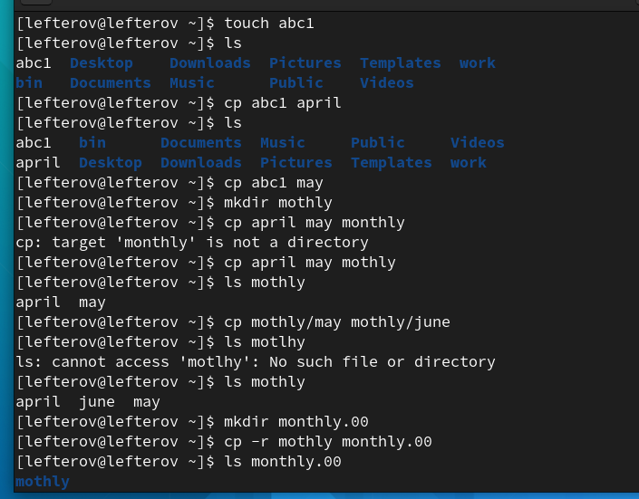{ #fig:001 width=70% }
##
Продолжение работы
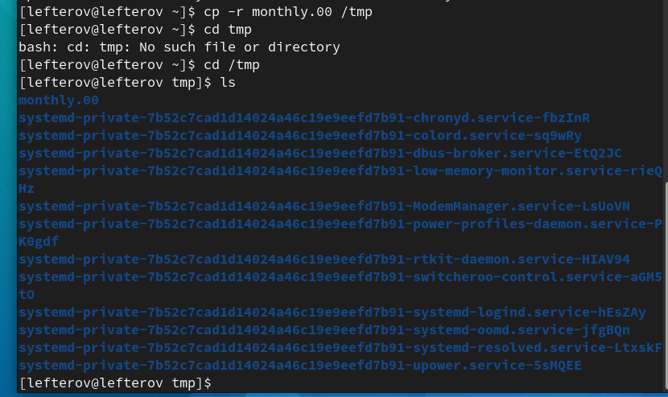{ #fig:002 width=70% }
##
Пишем pwd чтобы определить домашний каталол.
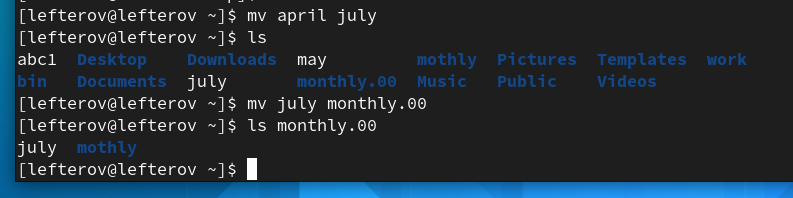{ #fig:003 width=70% }
##
Создаем в домашнем каталоге новый каталог с именем newdir
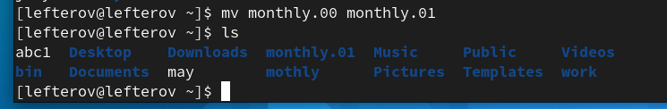{ #fig:004 width=70% }
##
В каталоге newdir создаем каталог с именем morefun
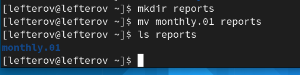{ #fig:005 width=70% }
##
В домашнем каталоге создаем 3 каталога  letters, memos, misk
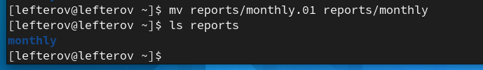{ #fig:006 width=70% }
##
Удаляем сощанных каталог командой rm, и проверяем командой ls
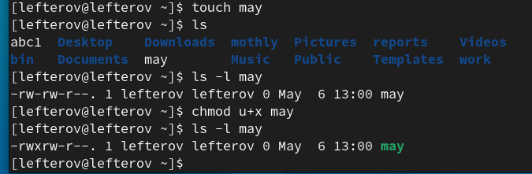{ #fig:007 width=70% }
##
С помощью команды man  опредлеяем  набор опций команды ls
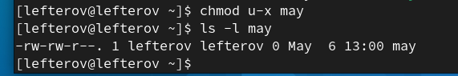{ #fig:008 width=70% }
##
Используя команду man проверяем описание следующих команд: cd,pwd,mkdir,rmdir,rm.
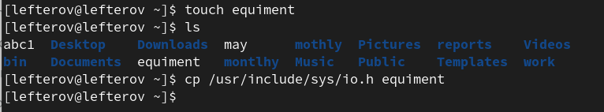{ #fig:009 width=70% }
##
Пишем команду history, и выполняем модификации и исполнение нескольких команд из буфера команд.
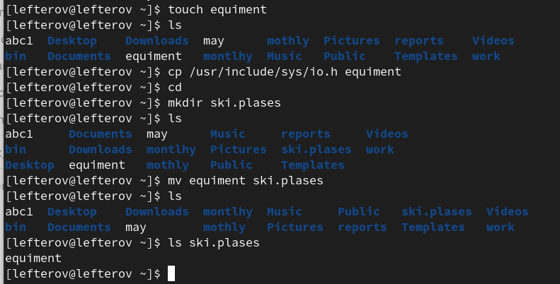{ #fig:0010 width=70% }
##
Создаем файл equepment
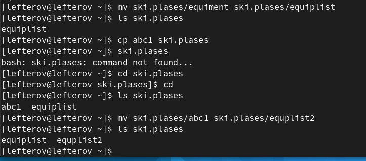{ #fig:0011 width=70% }
##
Создаем два euiplist, equplist2
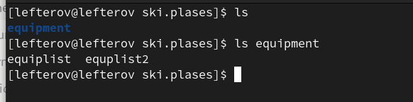{ #fig:0011 width=70% }
##

# Выводы

В ходе выполнения данной лабораторной работы были приобретены навыки создания, копирования файлов и права пользовательей.

# Ответы к контрольным вопросам
1). Командная строка – специальная программа, позволяющая управлять операционной системой при помощи текстовых команд, вводимых в окне приложения.
2). Для определения абсолютного пути к текущему каталогу используется команда pwd (print working directory). Например, команда «pwd» в моем домашнем каталоге выведет: /home/tbkonovalova
3). Команда «ls-F» (или «ls-aF», тогда появятся еще скрытые файлы) выведет имена файлов в текущем каталоге и их типы. Тип каталога обозначается /, тип исполняемого файла обозначается *, тип ссылки обозначается @. Пример на Рисунке 2.
4). Имена скрытых файлов начинаются с точки. Эти файлы в операционной системе скрыты от просмотра и обычно используются для настройки рабочей среды. Для того, чтобы отобразить имена скрытых файлов, необходимо использовать команду «ls –a». Пример на Рисунке 2.
5). Команда rm используется для удаления файлов и/или каталогов. Команда rm-i выдает запрос подтверждения наудаление файла. Команда rm-r необходима, чтобы удалить каталог, содержащий файлы. Без указания этой опции команда не будет выполняться. Если каталог пуст, то можно воспользоваться командой rmdir. Если удаляемый каталог содержит файлы, то команда не будет выполнена –нужно использовать «rm -r имя_каталога».Таким образом, каталог, не содержащий файлов, можно удалить и командой rm, и командой rmdir. Файл командой rmdir удалить нельзя. Примеры на Рисунке 9.
6). Чтобы определить, какие команды выполнил пользователь в сеансе работы, необходимо воспользоваться командой «history».
7). Чтобы исправить илизапустить на выполнение команду, которую пользователь уже использовал в сеансе работы, необходимо: в первом случае:воспользоваться конструкцией !<номер_команды>:s/<что_меняем>/<на_что_меняем>, во втором случае: !<номер_команды>. Примеры на Рисунке 21.
8). Чтобы записать в одной строке несколько команд, необходимо между ними поставить ; . Например, «cd /tmp; ls».
9). Символ обратного слэша позволяет использовать управляющие символы (".", "/", "$", "*", "[", "]", "^", "&") без их интерпретации командной оболочкой; процедура добавления данного символа перед управляющими символами называетсяэкранированием символов. Например, команда «lsnewdir\/morefun» отобразит содержимое каталога newdir/morefun.
10). Команда «ls -l» отображает список каталогов и файлов с подробной информацией о них (тип файла, право доступа, число ссылок, владелец, размер, дата последней ревизии, имя файла или каталога).
11). Полный, абсолютный путь от корня файловой системы –этот путь начинается от корня "/" и описывает весь путь к файлуили каталогу; Относительный путь – это путь к файлу относительно текущего каталога(каталога, где находится пользователь). Например, «cd/newdir/morefun» – абсолютный путь, «cdnewdir» – относительный путь.
12). Чтобы получить необходимую информацию о команде, необходимо воспользоваться конструкцией man[имя_команды], либо использовать опцию help, которая предусмотрена для некоторых команд.
13). Для автоматического дополнения вводимых команд служит клавиша Tab.
# Список литературы{.unnumbered}

::: {#refs}
:::
